# 🎬 FanFare — Architecture & Workflow Documentation

> **Pop Culture Prediction & Sentiment Platform**
>
> A Golang + MongoDB REST API powering fan predictions, community sentiment dashboards, crowdsourced context cards, and merit-based reputation.
>
> _Last updated: 28 May 2026_

---

## Table of Contents

1. [Product Overview](#1-product-overview)
2. [Technology Stack](#2-technology-stack)
3. [High-Level System Architecture](#3-high-level-system-architecture)
4. [Layered (Clean) Architecture](#4-layered-clean-architecture)
5. [Data Model & Entity-Relationship Diagram](#5-data-model--entity-relationship-diagram)
6. [MongoDB Collections & Indexing Strategy](#6-mongodb-collections--indexing-strategy)
7. [API Route Map](#7-api-route-map)
8. [Middleware Pipeline](#8-middleware-pipeline)
9. [Workflow: User Authentication](#9-workflow-user-authentication)
10. [Workflow: Prediction Lifecycle (Pillar 1)](#10-workflow-prediction-lifecycle-pillar-1)
11. [Workflow: Sentiment Polling & Dashboards (Pillar 2)](#11-workflow-sentiment-polling--dashboards-pillar-2)
12. [Workflow: Context Cards & Peer Ratings (Pillar 3)](#12-workflow-context-cards--peer-ratings-pillar-3)
13. [Workflow: Reputation & Badge Engine (Pillar 4)](#13-workflow-reputation--badge-engine-pillar-4)
14. [Workflow: News Feed Tag-Voting & Community Moderation (v2 Design)](#14-workflow-news-feed-tag-voting--community-moderation-v2-design)
15. [Service Dependency Matrix](#15-service-dependency-matrix)
16. [Configuration & Environment Variables](#16-configuration--environment-variables)
17. [Test Coverage](#17-test-coverage)
18. [Multi-Developer Setup](#18-multi-developer-setup)

---

## 1. Product Overview

FanFare is a social platform built around **four pillars** of fan engagement:

| Pillar | Feature | Description |
|--------|---------|-------------|
| 🎯 **Pillar 1** | Predictions | Structured prediction markets on pop culture events — users vote with confidence levels, earn points when resolved |
| 💬 **Pillar 2** | Sentiment Dashboards | Quick opinion polls with demographic cohort slicing (region, age band) to show how different communities feel |
| 📝 **Pillar 3** | Context Cards | Crowdsourced fact-check notes (what's accurate, missing, speculative) attached to moments, debates, or predictions |
| 🏆 **Pillar 4** | Reputation & Badges | Merit-based reputation system — insight over followers — with dynamic badges (Analyst, Lore Master, Hype Leader) |

### Content Hierarchy

```
Universe (Franchise)        e.g. "MCU", "DC Extended", "Taylor Swift"
  └── Title (Show/Film)     e.g. "Avengers: Secret Wars", "Stranger Things S5"
        ├── Moment (News)   e.g. "Deadpool crosses $1B — fastest MCU film"
        │     ├── Prediction    "Will it beat Endgame's record?"
        │     └── Context Card  Crowdsourced fact-check
        └── Issue Hub (Debate)  e.g. "Is the MCU in decline?"
              ├── Timeline events
              ├── Evidence stack
              ├── Predictions
              └── Sentiment Polls
```

---

## 2. Technology Stack

| Layer | Technology | Purpose |
|-------|-----------|---------|
| **Language** | Go 1.25+ | Backend application |
| **Web Framework** | Gin v1.12 | HTTP routing, middleware, JSON binding |
| **Database** | MongoDB (via `mongo-driver` v1.17) | Document store for all collections |
| **Authentication** | `golang-jwt/jwt/v5` + `bcrypt` | JWT Bearer tokens (HS256) + password hashing |
| **Configuration** | `godotenv` | Environment variable loading from `.env` |
| **API Spec** | OpenAPI 3.0 (Swagger) | `docs/swagger.yaml` |

### Key Go Dependencies

| Package | Version | Role |
|---------|---------|------|
| `github.com/gin-gonic/gin` | v1.12.0 | HTTP framework |
| `go.mongodb.org/mongo-driver` | v1.17.9 | MongoDB driver |
| `github.com/golang-jwt/jwt/v5` | v5.3.1 | JWT signing & validation |
| `golang.org/x/crypto` | v0.52.0 | Bcrypt password hashing |
| `github.com/joho/godotenv` | v1.5.1 | `.env` file loader |

---

## 3. High-Level System Architecture

This diagram shows the complete system from a 10,000-foot view — all clients, services, and infrastructure.

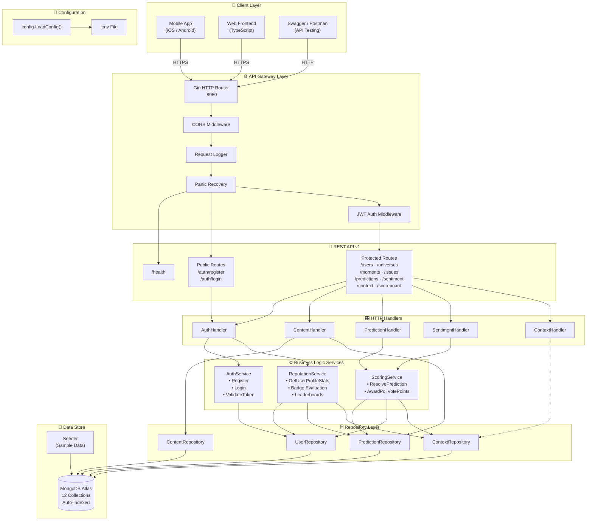
```mermaid
graph TB
    subgraph Clients["📱 Client Layer"]
        MobileApp["Mobile App<br/>(iOS / Android)"]
        WebApp["Web Frontend<br/>(TypeScript)"]
        Swagger["Swagger / Postman<br/>(API Testing)"]
    end

    subgraph Gateway["🌐 API Gateway Layer"]
        GinRouter["Gin HTTP Router<br/>:8080"]
        CORS["CORS Middleware"]
        Logger["Request Logger"]
        Recovery["Panic Recovery"]
        JWTAuth["JWT Auth Middleware"]
    end

    subgraph API["📡 REST API v1"]
        PublicRoutes["Public Routes<br/>/auth/register<br/>/auth/login"]
        ProtectedRoutes["Protected Routes<br/>/users · /universes<br/>/moments · /issues<br/>/predictions · /sentiment<br/>/context · /scoreboard"]
        HealthCheck["/health"]
    end

    subgraph Handlers["🎛️ HTTP Handlers"]
        AuthH["AuthHandler"]
        ContentH["ContentHandler"]
        PredH["PredictionHandler"]
        SentH["SentimentHandler"]
        CtxH["ContextHandler"]
    end

    subgraph Services["⚙️ Business Logic Services"]
        AuthSvc["AuthService<br/>• Register<br/>• Login<br/>• ValidateToken"]
        ScoringSvc["ScoringService<br/>• ResolvePrediction<br/>• AwardPollVotePoints"]
        RepSvc["ReputationService<br/>• GetUserProfileStats<br/>• Badge Evaluation<br/>• Leaderboards"]
    end

    subgraph Repository["🗄️ Repository Layer"]
        UserRepo["UserRepository"]
        ContentRepo["ContentRepository"]
        PredRepo["PredictionRepository"]
        CtxRepo["ContextRepository"]
    end

    subgraph DataStore["💾 Data Store"]
        MongoDB[("MongoDB Atlas<br/>12 Collections<br/>Auto-Indexed")]
        Seeder["Seeder<br/>(Sample Data)"]
    end

    subgraph Config["🔧 Configuration"]
        EnvFile[".env File"]
        ConfigLoader["config.LoadConfig()"]
    end

    MobileApp -->|HTTPS| GinRouter
    WebApp -->|HTTPS| GinRouter
    Swagger -->|HTTP| GinRouter

    GinRouter --> CORS --> Logger --> Recovery
    Recovery --> HealthCheck
    Recovery --> PublicRoutes
    Recovery --> JWTAuth --> ProtectedRoutes

    PublicRoutes --> AuthH
    ProtectedRoutes --> AuthH
    ProtectedRoutes --> ContentH
    ProtectedRoutes --> PredH
    ProtectedRoutes --> SentH
    ProtectedRoutes --> CtxH

    AuthH --> AuthSvc
    AuthH --> RepSvc
    PredH --> ScoringSvc
    SentH --> ScoringSvc
    CtxH -.-> CtxRepo

    AuthSvc --> UserRepo
    ScoringSvc --> PredRepo
    ScoringSvc --> UserRepo
    ScoringSvc --> CtxRepo
    RepSvc --> UserRepo
    RepSvc --> PredRepo
    RepSvc --> CtxRepo
    ContentH --> ContentRepo
    ContentH --> PredRepo

    UserRepo --> MongoDB
    ContentRepo --> MongoDB
    PredRepo --> MongoDB
    CtxRepo --> MongoDB
    Seeder --> MongoDB

    ConfigLoader --> EnvFile
```

### Architectural Decisions

| Decision | Rationale |
|----------|-----------|
| **Monolith** | Single deployable binary — suitable for a 2-person team; microservices deferred until scale demands |
| **Clean Architecture** | Interface-based repository layer decouples business logic from MongoDB; enables unit testing with mocks |
| **MongoDB** | Document model fits nested structures (timelines, evidence stacks, options arrays); flexible schema for rapid iteration |
| **JWT Bearer** | Stateless auth; 72-hour token expiry balances security and UX for mobile clients |
| **Gin framework** | High-performance, battle-tested Go HTTP framework with middleware ecosystem |

---

## 4. Layered (Clean) Architecture

FanFare uses a strict layered architecture where each layer only depends on the layer below it via **interfaces**.

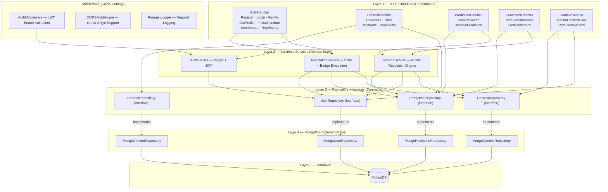
```mermaid
graph TD
    subgraph L1["Layer 1 — HTTP Handlers (Presentation)"]
        AH["AuthHandler<br/>Register · Login · GetMe<br/>GetProfile · FollowFandom<br/>Scoreboard · RepHistory"]
        CH["ContentHandler<br/>Universes · Titles<br/>Moments · IssueHubs"]
        PH["PredictionHandler<br/>VotePrediction<br/>ResolvePrediction"]
        SH["SentimentHandler<br/>VoteSentimentPoll<br/>GetDashboard"]
        XH["ContextHandler<br/>CreateContextCard<br/>RateContextCard"]
    end

    subgraph MW["Middleware (Cross-Cutting)"]
        AM["AuthMiddleware — JWT Bearer Validation"]
        CM["CORSMiddleware — Cross-Origin Support"]
        LM["RequestLogger — Request Logging"]
    end

    subgraph L2["Layer 2 — Business Services (Domain Logic)"]
        AS["AuthService — Bcrypt + JWT"]
        SS["ScoringService — Points Resolution Engine"]
        RS["ReputationService — Stats + Badge Evaluation"]
    end

    subgraph L3["Layer 3 — Repository Interfaces (Contracts)"]
        UI["UserRepository (interface)"]
        CI["ContentRepository (interface)"]
        PI["PredictionRepository (interface)"]
        XI["ContextRepository (interface)"]
    end

    subgraph L4["Layer 4 — MongoDB Implementations"]
        UR["MongoUserRepository"]
        CR["MongoContentRepository"]
        PR["MongoPredictionRepository"]
        XR["MongoContextRepository"]
    end

    subgraph L5["Layer 5 — Database"]
        DB[("MongoDB")]
    end

    AH --> AS & RS
    CH --> CI & PI
    PH --> PI & SS
    SH --> PI & SS
    XH --> XI & UI

    AM --> AS

    AS --> UI
    SS --> PI & UI & XI
    RS --> UI & PI & XI

    UI -.->|implements| UR
    CI -.->|implements| CR
    PI -.->|implements| PR
    XI -.->|implements| XR

    UR & CR & PR & XR --> DB
```

### Layer Responsibilities

| Layer | Directory | Purpose |
|-------|-----------|---------|
| **Handlers** | `internal/handlers/` | HTTP request parsing, input validation, JSON response serialization |
| **Middleware** | `internal/middleware/` | JWT auth, CORS, request logging — cross-cutting concerns |
| **Services** | `internal/services/` | Business rules: authentication, scoring algorithms, badge evaluation |
| **Interfaces** | `internal/repository/interfaces.go` | Go interfaces defining CRUD contracts; **the critical decoupling seam** |
| **MongoDB** | `internal/repository/mongodb/` | Concrete implementations using `mongo-driver`; only layer that imports MongoDB SDK |
| **Models** | `internal/models/` | BSON/JSON struct definitions shared across all layers |
| **Config** | `internal/config/` | Environment variable loading |
| **DB** | `internal/db/` | Connection setup, index creation, sample data seeding |

> **Why interfaces matter:** Services never import `go.mongodb.org/mongo-driver`. They only depend on the interfaces in `internal/repository/interfaces.go`. This means you can:
> - Unit test services with mock repositories (already done for `auth_service_test.go`, `scoring_service_test.go`, `reputation_service_test.go`)
> - Swap MongoDB for PostgreSQL, DynamoDB, or any store by implementing the same interfaces
> - Develop and test offline without a running database

---

## 5. Data Model & Entity-Relationship Diagram

FanFare uses **12 MongoDB collections** linked through ObjectID references with compound unique indexes enforcing data integrity.

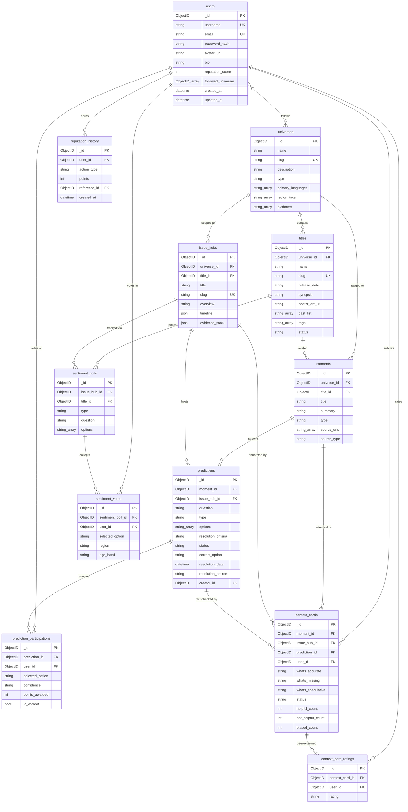
```mermaid
erDiagram
    users {
        ObjectID _id PK
        string username UK
        string email UK
        string password_hash
        string avatar_url
        string bio
        int reputation_score
        ObjectID_array followed_universes
        datetime created_at
        datetime updated_at
    }

    universes {
        ObjectID _id PK
        string name
        string slug UK
        string description
        string type
        string_array primary_languages
        string_array region_tags
        string_array platforms
    }

    titles {
        ObjectID _id PK
        ObjectID universe_id FK
        string name
        string slug UK
        string release_date
        string synopsis
        string poster_art_url
        string_array cast_list
        string_array tags
        string status
    }

    moments {
        ObjectID _id PK
        ObjectID universe_id FK
        ObjectID title_id FK
        string title
        string summary
        string type
        string_array source_urls
        string source_type
    }

    issue_hubs {
        ObjectID _id PK
        ObjectID universe_id FK
        ObjectID title_id FK
        string title
        string slug UK
        string overview
        json timeline
        json evidence_stack
    }

    predictions {
        ObjectID _id PK
        ObjectID moment_id FK
        ObjectID issue_hub_id FK
        string question
        string type
        string_array options
        string resolution_criteria
        string status
        string correct_option
        datetime resolution_date
        string resolution_source
        ObjectID creator_id FK
    }

    prediction_participations {
        ObjectID _id PK
        ObjectID prediction_id FK
        ObjectID user_id FK
        string selected_option
        string confidence
        int points_awarded
        bool is_correct
    }

    sentiment_polls {
        ObjectID _id PK
        ObjectID issue_hub_id FK
        ObjectID title_id FK
        string type
        string question
        string_array options
    }

    sentiment_votes {
        ObjectID _id PK
        ObjectID sentiment_poll_id FK
        ObjectID user_id FK
        string selected_option
        string region
        string age_band
    }

    context_cards {
        ObjectID _id PK
        ObjectID moment_id FK
        ObjectID issue_hub_id FK
        ObjectID prediction_id FK
        ObjectID user_id FK
        string whats_accurate
        string whats_missing
        string whats_speculative
        string status
        int helpful_count
        int not_helpful_count
        int biased_count
    }

    context_card_ratings {
        ObjectID _id PK
        ObjectID context_card_id FK
        ObjectID user_id FK
        string rating
    }

    reputation_history {
        ObjectID _id PK
        ObjectID user_id FK
        string action_type
        int points
        ObjectID reference_id FK
        datetime created_at
    }

    users ||--o{ prediction_participations : "votes on"
    users ||--o{ sentiment_votes : "votes in"
    users ||--o{ context_cards : "submits"
    users ||--o{ context_card_ratings : "rates"
    users ||--o{ reputation_history : "earns"
    users }o--o{ universes : "follows"

    universes ||--o{ titles : "contains"
    universes ||--o{ moments : "tagged to"
    universes ||--o{ issue_hubs : "scoped to"

    titles ||--o{ moments : "related"
    titles ||--o{ sentiment_polls : "polled about"

    moments ||--o{ predictions : "spawns"
    moments ||--o{ context_cards : "attached to"

    issue_hubs ||--o{ predictions : "hosts"
    issue_hubs ||--o{ sentiment_polls : "tracked via"
    issue_hubs ||--o{ context_cards : "annotated by"

    predictions ||--o{ prediction_participations : "receives"
    predictions ||--o{ context_cards : "fact-checked by"

    sentiment_polls ||--o{ sentiment_votes : "collects"

    context_cards ||--o{ context_card_ratings : "peer-reviewed"
```

---

## 6. MongoDB Collections & Indexing Strategy

All indexes are created automatically at server startup via `db.EnsureIndexes()` in `internal/db/mongo.go`.

| # | Collection | Description | Unique Indexes | Performance Indexes |
|---|-----------|-------------|----------------|---------------------|
| 1 | `users` | User accounts & reputation | `username`, `email` | — |
| 2 | `universes` | Franchise IPs (MCU, DC, etc.) | `slug` | — |
| 3 | `titles` | Watchable units (shows, films) | `slug` | `universe_id` |
| 4 | `moments` | News feed items | — | `universe_id`, `title_id`, `created_at` |
| 5 | `issue_hubs` | Long-running debates | `slug` | `universe_id` |
| 6 | `predictions` | Votable prediction questions | — | `moment_id`, `issue_hub_id`, `status` |
| 7 | `prediction_participations` | User prediction votes | `{prediction_id, user_id}` (compound) | — |
| 8 | `sentiment_polls` | Opinion polls | — | `issue_hub_id`, `title_id` |
| 9 | `sentiment_votes` | Poll votes with demographics | `{sentiment_poll_id, user_id}` (compound) | `region`, `age_band` |
| 10 | `context_cards` | Community fact-check notes | — | `moment_id`, `issue_hub_id`, `prediction_id` |
| 11 | `context_card_ratings` | Card peer reviews | `{context_card_id, user_id}` (compound) | — |
| 12 | `reputation_history` | Points audit trail | — | `user_id` |

> **Compound unique indexes** (rows 7, 9, 11) enforce "one vote per user per entity" at the database level. Even if the application logic fails, MongoDB will reject duplicate votes.

---

## 7. API Route Map

Base URL: `http://localhost:8080/api/v1`

### Public Routes (No Authentication)

| Method | Endpoint | Handler | Description |
|--------|----------|---------|-------------|
| `GET` | `/health` | inline | Health check |
| `POST` | `/auth/register` | `AuthHandler.Register` | Register a new user account |
| `POST` | `/auth/login` | `AuthHandler.Login` | Authenticate and receive JWT |

### Protected Routes (JWT Bearer Required)

#### Users & Profiles

| Method | Endpoint | Handler | Description |
|--------|----------|---------|-------------|
| `GET` | `/users/me` | `AuthHandler.GetMe` | Authenticated user's profile + stats + badges |
| `GET` | `/users/me/reputation` | `AuthHandler.GetReputationHistory` | Full reputation points audit trail |
| `GET` | `/users/:username` | `AuthHandler.GetUserProfile` | Any user's public profile with stats |
| `POST` | `/users/follow-fandom` | `AuthHandler.FollowFandom` | Follow a universe |
| `GET` | `/scoreboard` | `AuthHandler.GetScoreboard` | Global or fandom-specific leaderboard |

#### Content Catalog

| Method | Endpoint | Handler | Description |
|--------|----------|---------|-------------|
| `GET` | `/universes` | `ContentHandler.ListUniverses` | List all franchise universes |
| `GET` | `/universes/:slug` | `ContentHandler.GetUniverse` | Universe details with its titles |
| `GET` | `/titles/:slug` | `ContentHandler.GetTitle` | Individual title details |

#### News Feed & Debates

| Method | Endpoint | Handler | Description |
|--------|----------|---------|-------------|
| `GET` | `/moments` | `ContentHandler.ListMoments` | Paginated news feed (limit, offset) |
| `GET` | `/moments/:id` | `ContentHandler.GetMoment` | Single moment card |
| `GET` | `/moments/:id/predictions` | `ContentHandler.ListMomentPredictions` | Predictions attached to a moment |
| `GET` | `/issues` | `ContentHandler.ListIssueHubs` | List all debate hubs (sort: activity/recent) |
| `GET` | `/issues/:slug` | `ContentHandler.GetIssueHub` | Debate hub with timeline + evidence |
| `GET` | `/issues/:slug/predictions` | `ContentHandler.ListIssueHubPredictions` | Predictions within a debate |

#### Predictions (Pillar 1)

| Method | Endpoint | Handler | Description |
|--------|----------|---------|-------------|
| `POST` | `/predictions/:id/vote` | `PredictionHandler.VotePrediction` | Place prediction vote with confidence |
| `POST` | `/predictions/:id/resolve` | `PredictionHandler.ResolvePrediction` | Resolve with correct option + source |

#### Sentiment (Pillar 2)

| Method | Endpoint | Handler | Description |
|--------|----------|---------|-------------|
| `GET` | `/sentiment/dashboards/:type/:id` | `SentimentHandler.GetSentimentDashboard` | Aggregated metrics (optionally by cohort) |
| `POST` | `/sentiment/polls/:id/vote` | `SentimentHandler.VoteSentimentPoll` | Vote in sentiment poll |

#### Context Cards (Pillar 3)

| Method | Endpoint | Handler | Description |
|--------|----------|---------|-------------|
| `POST` | `/context` | `ContextHandler.CreateContextCard` | Submit a context card |
| `POST` | `/context/:id/rate` | `ContextHandler.RateContextCard` | Rate as helpful/not_helpful/biased |

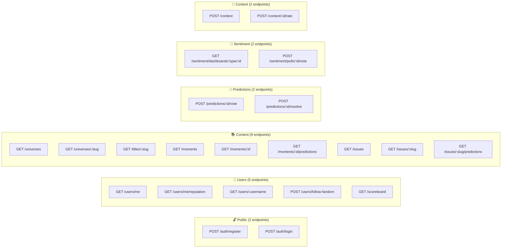
```mermaid
graph LR
    subgraph Public["🔓 Public (2 endpoints)"]
        R1["POST /auth/register"]
        R2["POST /auth/login"]
    end

    subgraph Users["👤 Users (5 endpoints)"]
        R3["GET /users/me"]
        R4["GET /users/me/reputation"]
        R5["GET /users/:username"]
        R6["POST /users/follow-fandom"]
        R7["GET /scoreboard"]
    end

    subgraph Content["📚 Content (9 endpoints)"]
        R8["GET /universes"]
        R9["GET /universes/:slug"]
        R10["GET /titles/:slug"]
        R11["GET /moments"]
        R12["GET /moments/:id"]
        R13["GET /moments/:id/predictions"]
        R14["GET /issues"]
        R15["GET /issues/:slug"]
        R16["GET /issues/:slug/predictions"]
    end

    subgraph Predictions["🎯 Predictions (2 endpoints)"]
        R17["POST /predictions/:id/vote"]
        R18["POST /predictions/:id/resolve"]
    end

    subgraph Sentiment["💬 Sentiment (2 endpoints)"]
        R19["GET /sentiment/dashboards/:type/:id"]
        R20["POST /sentiment/polls/:id/vote"]
    end

    subgraph Context["📝 Context (2 endpoints)"]
        R21["POST /context"]
        R22["POST /context/:id/rate"]
    end
```

**Total: 22 endpoints** (2 public + 20 protected)

---

## 8. Middleware Pipeline

Every incoming HTTP request passes through the middleware chain in this exact order:

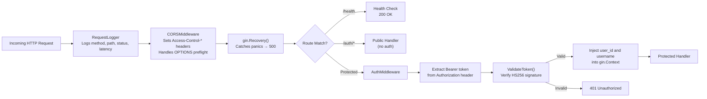
```mermaid
flowchart LR
    Request["Incoming HTTP Request"] --> Logger["RequestLogger<br/>Logs method, path, status, latency"]
    Logger --> CORS["CORSMiddleware<br/>Sets Access-Control-* headers<br/>Handles OPTIONS preflight"]
    CORS --> Recovery["gin.Recovery()<br/>Catches panics → 500"]
    Recovery --> RouteMatch{"Route Match?"}
    RouteMatch -->|"/health"| Health["Health Check<br/>200 OK"]
    RouteMatch -->|"/auth/*"| PublicHandler["Public Handler<br/>(no auth)"]
    RouteMatch -->|"Protected"| AuthMW["AuthMiddleware"]
    AuthMW --> ExtractToken["Extract Bearer token<br/>from Authorization header"]
    ExtractToken --> ValidateJWT["ValidateToken()<br/>Verify HS256 signature"]
    ValidateJWT -->|Valid| InjectCtx["Inject user_id and username<br/>into gin.Context"]
    ValidateJWT -->|Invalid| Reject401["401 Unauthorized"]
    InjectCtx --> ProtectedHandler["Protected Handler"]
```

### Middleware Details

| Middleware | File | Responsibility |
|-----------|------|----------------|
| **RequestLogger** | `internal/middleware/logging.go` | Logs HTTP method, path, response status, and latency for every request |
| **CORSMiddleware** | `internal/middleware/cors.go` | Sets `Access-Control-Allow-Origin`, `Allow-Methods`, `Allow-Headers`; handles `OPTIONS` preflight |
| **gin.Recovery** | Built-in Gin | Catches panics in handlers, logs stack trace, returns 500 |
| **AuthMiddleware** | `internal/middleware/auth_middleware.go` | Extracts JWT from `Authorization: Bearer <token>`, validates signature, injects `user_id` and `username` into request context |

---

## 9. Workflow: User Authentication

### 9.1 Registration Flow

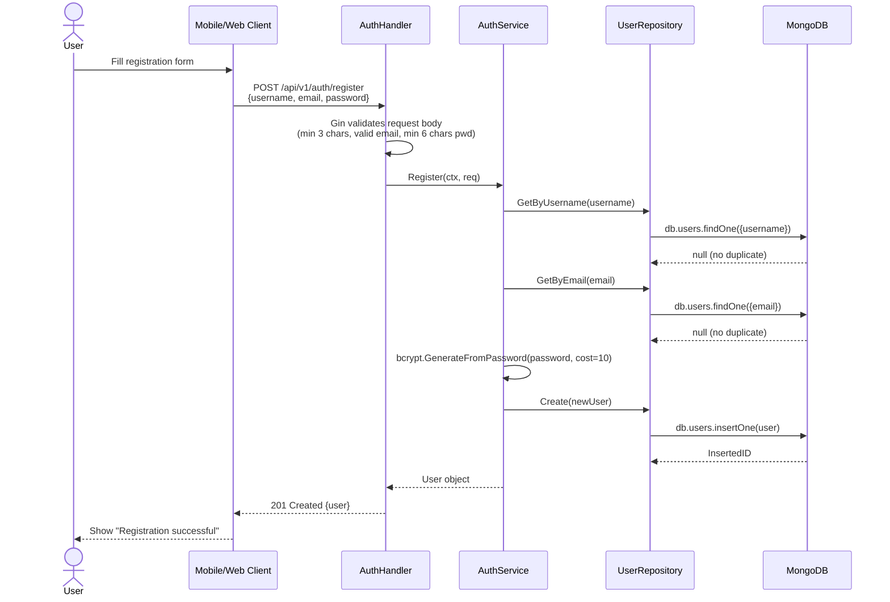
```mermaid
sequenceDiagram
    actor User
    participant Client as Mobile/Web Client
    participant AH as AuthHandler
    participant AS as AuthService
    participant UR as UserRepository
    participant DB as MongoDB

    User->>Client: Fill registration form
    Client->>AH: POST /api/v1/auth/register<br/>{username, email, password}
    AH->>AH: Gin validates request body<br/>(min 3 chars, valid email, min 6 chars pwd)
    AH->>AS: Register(ctx, req)
    AS->>UR: GetByUsername(username)
    UR->>DB: db.users.findOne({username})
    DB-->>UR: null (no duplicate)
    AS->>UR: GetByEmail(email)
    UR->>DB: db.users.findOne({email})
    DB-->>UR: null (no duplicate)
    AS->>AS: bcrypt.GenerateFromPassword(password, cost=10)
    AS->>UR: Create(newUser)
    UR->>DB: db.users.insertOne(user)
    DB-->>UR: InsertedID
    AS-->>AH: User object
    AH-->>Client: 201 Created {user}
    Client-->>User: Show "Registration successful"
```

### 9.2 Login Flow

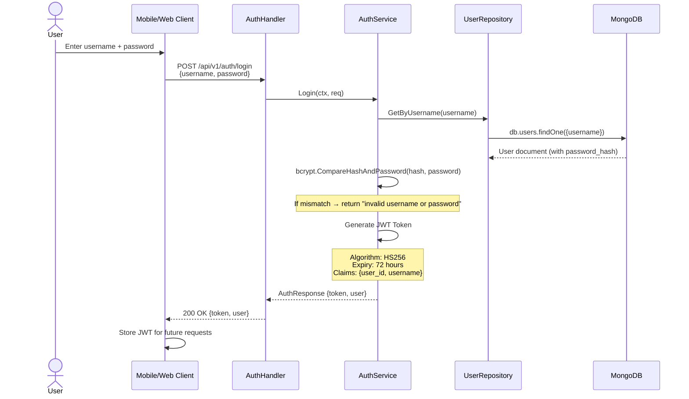
```mermaid
sequenceDiagram
    actor User
    participant Client as Mobile/Web Client
    participant AH as AuthHandler
    participant AS as AuthService
    participant UR as UserRepository
    participant DB as MongoDB

    User->>Client: Enter username + password
    Client->>AH: POST /api/v1/auth/login<br/>{username, password}
    AH->>AS: Login(ctx, req)
    AS->>UR: GetByUsername(username)
    UR->>DB: db.users.findOne({username})
    DB-->>UR: User document (with password_hash)
    AS->>AS: bcrypt.CompareHashAndPassword(hash, password)
    Note over AS: If mismatch → return "invalid username or password"
    AS->>AS: Generate JWT Token
    Note over AS: Algorithm: HS256<br/>Expiry: 72 hours<br/>Claims: {user_id, username}
    AS-->>AH: AuthResponse {token, user}
    AH-->>Client: 200 OK {token, user}
    Client->>Client: Store JWT for future requests
```

### 9.3 Protected Request Flow

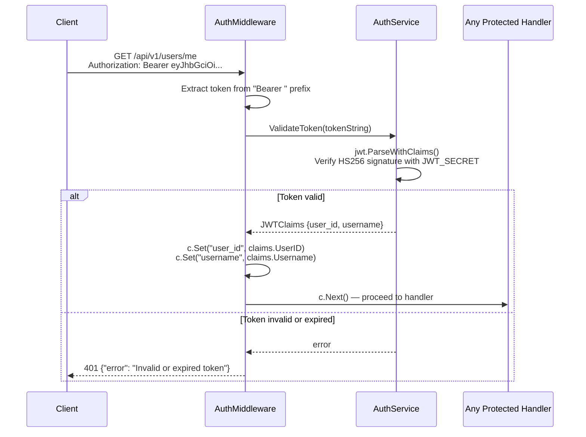
```mermaid
sequenceDiagram
    participant Client
    participant MW as AuthMiddleware
    participant AS as AuthService
    participant Handler as Any Protected Handler

    Client->>MW: GET /api/v1/users/me<br/>Authorization: Bearer eyJhbGciOi...
    MW->>MW: Extract token from "Bearer " prefix
    MW->>AS: ValidateToken(tokenString)
    AS->>AS: jwt.ParseWithClaims()<br/>Verify HS256 signature with JWT_SECRET
    alt Token valid
        AS-->>MW: JWTClaims {user_id, username}
        MW->>MW: c.Set("user_id", claims.UserID)<br/>c.Set("username", claims.Username)
        MW->>Handler: c.Next() — proceed to handler
    else Token invalid or expired
        AS-->>MW: error
        MW-->>Client: 401 {"error": "Invalid or expired token"}
    end
```

---

## 10. Workflow: Prediction Lifecycle (Pillar 1)

This is the **core gameplay loop** — the prediction market that drives engagement and reputation.

### 10.1 Place a Prediction Vote

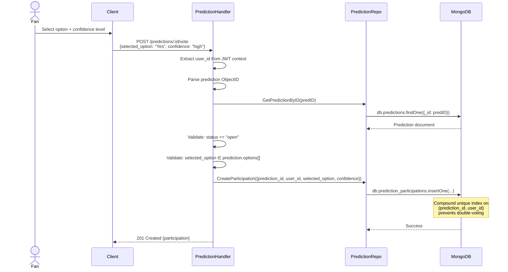
```mermaid
sequenceDiagram
    actor Fan
    participant Client
    participant PH as PredictionHandler
    participant PR as PredictionRepo
    participant DB as MongoDB

    Fan->>Client: Select option + confidence level
    Client->>PH: POST /predictions/:id/vote<br/>{selected_option: "Yes", confidence: "high"}
    PH->>PH: Extract user_id from JWT context
    PH->>PH: Parse prediction ObjectID
    PH->>PR: GetPredictionByID(predID)
    PR->>DB: db.predictions.findOne({_id: predID})
    DB-->>PR: Prediction document

    PH->>PH: Validate: status == "open"
    PH->>PH: Validate: selected_option ∈ prediction.options[]

    PH->>PR: CreateParticipation({prediction_id, user_id, selected_option, confidence})
    PR->>DB: db.prediction_participations.insertOne(...)
    Note over DB: Compound unique index on<br/>(prediction_id, user_id)<br/>prevents double-voting
    DB-->>PR: Success
    PH-->>Client: 201 Created {participation}
```

### 10.2 Resolve a Prediction (Scoring Engine)

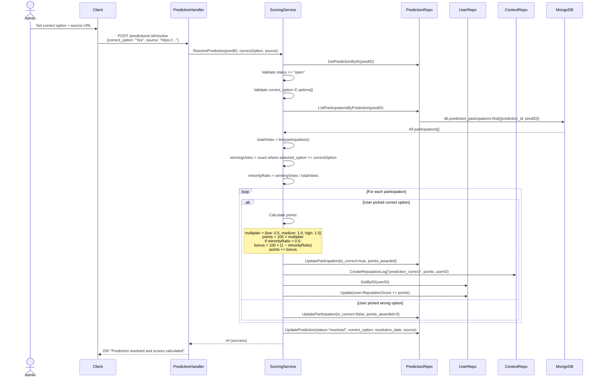
```mermaid
sequenceDiagram
    actor Admin
    participant Client
    participant PH as PredictionHandler
    participant SS as ScoringService
    participant PR as PredictionRepo
    participant UR as UserRepo
    participant CR as ContextRepo
    participant DB as MongoDB

    Admin->>Client: Set correct option + source URL
    Client->>PH: POST /predictions/:id/resolve<br/>{correct_option: "Yes", source: "https://..."}
    PH->>SS: ResolvePrediction(predID, correctOption, source)

    SS->>PR: GetPredictionByID(predID)
    SS->>SS: Validate status == "open"
    SS->>SS: Validate correct_option ∈ options[]

    SS->>PR: ListParticipationsByPrediction(predID)
    PR->>DB: db.prediction_participations.find({prediction_id: predID})
    DB-->>SS: All participations[]

    SS->>SS: totalVotes = len(participations)
    SS->>SS: winningVotes = count where selected_option == correctOption
    SS->>SS: minorityRatio = winningVotes / totalVotes

    loop For each participation
        alt User picked correct option
            SS->>SS: Calculate points:
            Note over SS: multiplier = {low: 0.5, medium: 1.0, high: 1.5}<br/>points = 100 × multiplier<br/>if minorityRatio < 0.5:<br/>    bonus = 100 × (1 − minorityRatio)<br/>    points += bonus
            SS->>PR: UpdateParticipation(is_correct=true, points_awarded)
            SS->>CR: CreateReputationLog("prediction_correct", points, userID)
            SS->>UR: GetByID(userID)
            SS->>UR: Update(user.ReputationScore += points)
        else User picked wrong option
            SS->>PR: UpdateParticipation(is_correct=false, points_awarded=0)
        end
    end

    SS->>PR: UpdatePrediction(status="resolved", correct_option, resolution_date, source)
    SS-->>PH: nil (success)
    PH-->>Client: 200 "Prediction resolved and scores calculated"
```

### 10.3 Points Calculation Formula

```
                                         ┌─────────────────────────────┐
                                         │    SCORING FORMULA          │
                                         ├─────────────────────────────┤
                                         │                             │
  Base Points = 100                      │  points = base × multiplier │
                                         │                             │
  Confidence Multiplier:                 │  if minority_ratio < 0.5:   │
    • low    → 0.5×  (= 50 pts)         │    bonus = base × (1 - mr)  │
    • medium → 1.0×  (= 100 pts)        │    points += bonus           │
    • high   → 1.5×  (= 150 pts)        │                             │
                                         │  final = int(points)        │
                                         └─────────────────────────────┘
```

#### Points Examples

| Scenario | Confidence | Minority Ratio | Base | Multiplier | Minority Bonus | **Total** |
|----------|:----------:|:--------------:|:----:|:----------:|:--------------:|:---------:|
| Majority correct (60% right) | Medium | 0.60 | 100 | 1.0× | 0 (ratio ≥ 0.5) | **100** |
| Majority correct (60% right) | High | 0.60 | 100 | 1.5× | 0 | **150** |
| Minority correct (30% right) | Medium | 0.30 | 100 | 1.0× | 70 | **170** |
| Minority correct (10% right) | High | 0.10 | 100 | 1.5× | 90 | **240** |
| Minority correct (10% right) | Low | 0.10 | 100 | 0.5× | 90 | **140** |
| Wrong prediction | Any | — | 0 | — | 0 | **0** |

> **Design insight:** The minority bonus rewards **contrarian thinking**. If most people guess wrong, the few who got it right receive a significant bonus — up to +100 extra points.

---

## 11. Workflow: Sentiment Polling & Dashboards (Pillar 2)

### 11.1 Vote in Sentiment Poll

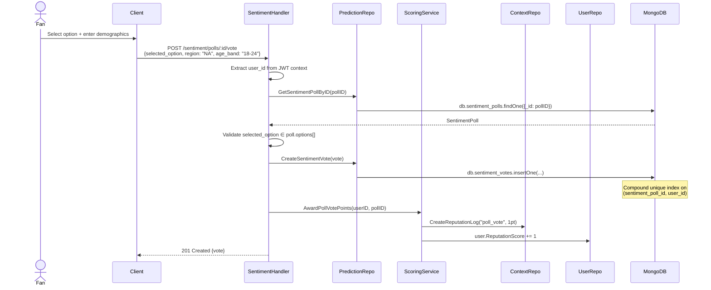
```mermaid
sequenceDiagram
    actor Fan
    participant Client
    participant SH as SentimentHandler
    participant PR as PredictionRepo
    participant SS as ScoringService
    participant CR as ContextRepo
    participant UR as UserRepo
    participant DB as MongoDB

    Fan->>Client: Select option + enter demographics
    Client->>SH: POST /sentiment/polls/:id/vote<br/>{selected_option, region: "NA", age_band: "18-24"}
    SH->>SH: Extract user_id from JWT context
    SH->>PR: GetSentimentPollByID(pollID)
    PR->>DB: db.sentiment_polls.findOne({_id: pollID})
    DB-->>SH: SentimentPoll
    SH->>SH: Validate selected_option ∈ poll.options[]
    SH->>PR: CreateSentimentVote(vote)
    PR->>DB: db.sentiment_votes.insertOne(...)
    Note over DB: Compound unique index on<br/>(sentiment_poll_id, user_id)
    SH->>SS: AwardPollVotePoints(userID, pollID)
    SS->>CR: CreateReputationLog("poll_vote", 1pt)
    SS->>UR: user.ReputationScore += 1
    SH-->>Client: 201 Created {vote}
```

### 11.2 View Sentiment Dashboard

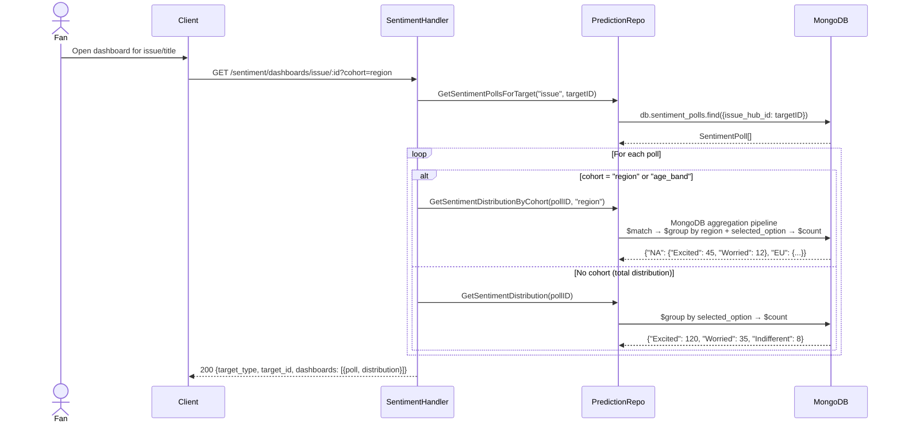
```mermaid
sequenceDiagram
    actor Fan
    participant Client
    participant SH as SentimentHandler
    participant PR as PredictionRepo
    participant DB as MongoDB

    Fan->>Client: Open dashboard for issue/title
    Client->>SH: GET /sentiment/dashboards/issue/:id?cohort=region
    SH->>PR: GetSentimentPollsForTarget("issue", targetID)
    PR->>DB: db.sentiment_polls.find({issue_hub_id: targetID})
    DB-->>PR: SentimentPoll[]

    loop For each poll
        alt cohort = "region" or "age_band"
            SH->>PR: GetSentimentDistributionByCohort(pollID, "region")
            PR->>DB: MongoDB aggregation pipeline<br/>$match → $group by region + selected_option → $count
            DB-->>PR: {"NA": {"Excited": 45, "Worried": 12}, "EU": {...}}
        else No cohort (total distribution)
            SH->>PR: GetSentimentDistribution(pollID)
            PR->>DB: $group by selected_option → $count
            DB-->>PR: {"Excited": 120, "Worried": 35, "Indifferent": 8}
        end
    end

    SH-->>Client: 200 {target_type, target_id, dashboards: [{poll, distribution}]}
```

> **Unique differentiator:** Sentiment data supports **demographic cohort slicing** by `region` and `age_band`, enabling the platform to show how different communities feel about pop culture topics — e.g. "North American fans are 80% excited about Avengers: Secret Wars, while European fans are split 50/50."

---

## 12. Workflow: Context Cards & Peer Ratings (Pillar 3)

### 12.1 Submit a Context Card

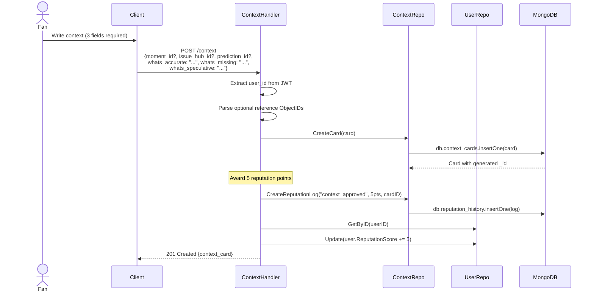
```mermaid
sequenceDiagram
    actor Fan
    participant Client
    participant XH as ContextHandler
    participant XR as ContextRepo
    participant UR as UserRepo
    participant DB as MongoDB

    Fan->>Client: Write context (3 fields required)
    Client->>XH: POST /context<br/>{moment_id?, issue_hub_id?, prediction_id?,<br/>whats_accurate: "...", whats_missing: "...",<br/>whats_speculative: "..."}
    XH->>XH: Extract user_id from JWT
    XH->>XH: Parse optional reference ObjectIDs
    XH->>XR: CreateCard(card)
    XR->>DB: db.context_cards.insertOne(card)
    DB-->>XR: Card with generated _id

    Note over XH: Award 5 reputation points
    XH->>XR: CreateReputationLog("context_approved", 5pts, cardID)
    XR->>DB: db.reputation_history.insertOne(log)
    XH->>UR: GetByID(userID)
    XH->>UR: Update(user.ReputationScore += 5)
    XH-->>Client: 201 Created {context_card}
```

### 12.2 Rate a Context Card

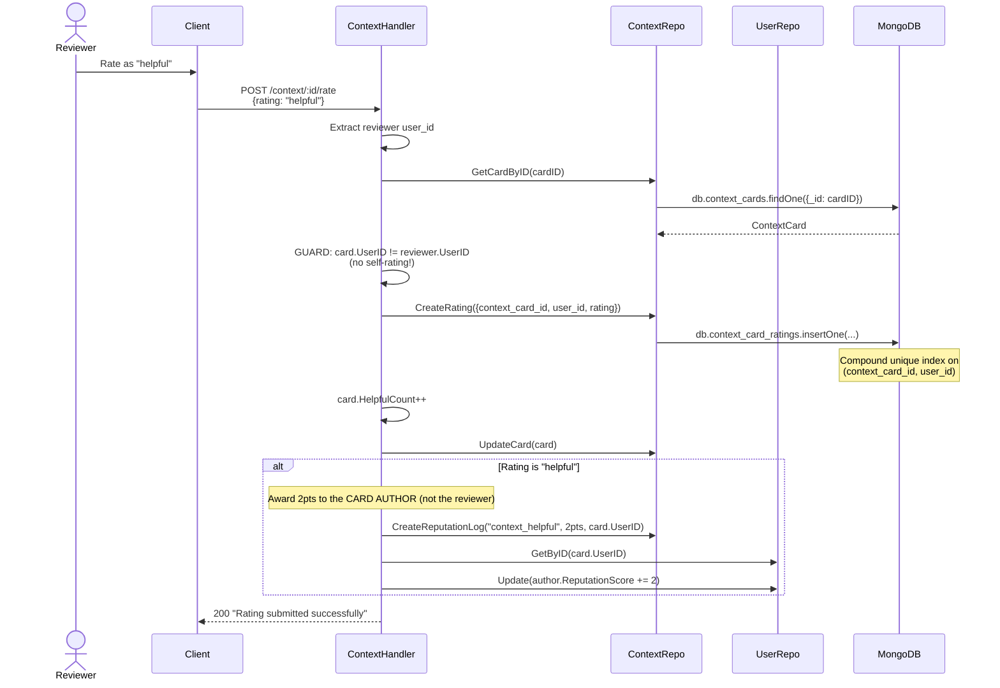
```mermaid
sequenceDiagram
    actor Reviewer
    participant Client
    participant XH as ContextHandler
    participant XR as ContextRepo
    participant UR as UserRepo
    participant DB as MongoDB

    Reviewer->>Client: Rate as "helpful"
    Client->>XH: POST /context/:id/rate<br/>{rating: "helpful"}
    XH->>XH: Extract reviewer user_id
    XH->>XR: GetCardByID(cardID)
    XR->>DB: db.context_cards.findOne({_id: cardID})
    DB-->>XR: ContextCard

    XH->>XH: GUARD: card.UserID != reviewer.UserID<br/>(no self-rating!)

    XH->>XR: CreateRating({context_card_id, user_id, rating})
    XR->>DB: db.context_card_ratings.insertOne(...)
    Note over DB: Compound unique index on<br/>(context_card_id, user_id)

    XH->>XH: card.HelpfulCount++
    XH->>XR: UpdateCard(card)

    alt Rating is "helpful"
        Note over XH: Award 2pts to the CARD AUTHOR (not the reviewer)
        XH->>XR: CreateReputationLog("context_helpful", 2pts, card.UserID)
        XH->>UR: GetByID(card.UserID)
        XH->>UR: Update(author.ReputationScore += 2)
    end

    XH-->>Client: 200 "Rating submitted successfully"
```

### Context Card Reputation Summary

| Action | Points | Recipient | When |
|--------|:------:|-----------|------|
| Submit context card | **+5** pts | Card author | On creation |
| Card rated "helpful" | **+2** pts | Card author | Per helpful rating |
| Card rated "not_helpful" | 0 pts | — | Counter incremented only |
| Card rated "biased" | 0 pts | — | Counter incremented only |
| Vote in sentiment poll | **+1** pt | Voter | On vote placement |

---

## 13. Workflow: Reputation & Badge Engine (Pillar 4)

### 13.1 Profile Stats Compilation

When any user profile is requested (`GET /users/:username` or `GET /users/me`), the `ReputationService` compiles real-time statistics:

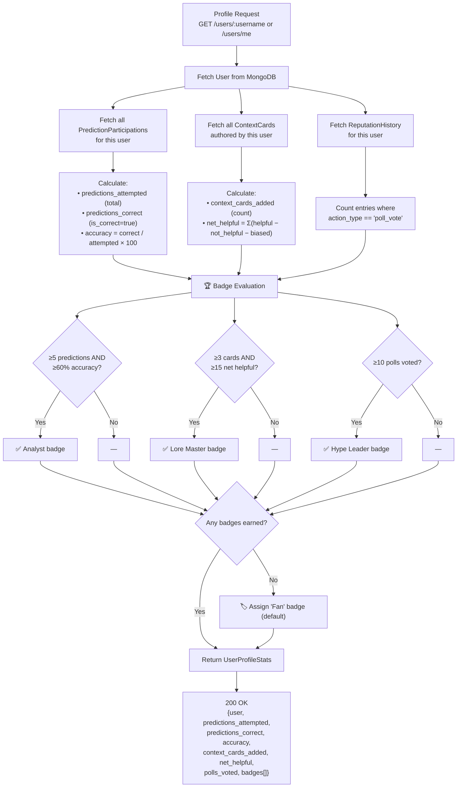
```mermaid
flowchart TD
    Start["Profile Request<br/>GET /users/:username or /users/me"] --> FetchUser["Fetch User from MongoDB"]

    FetchUser --> FetchPreds["Fetch all PredictionParticipations<br/>for this user"]
    FetchPreds --> CalcPreds["Calculate:<br/>• predictions_attempted (total)<br/>• predictions_correct (is_correct=true)<br/>• accuracy = correct / attempted × 100"]

    FetchUser --> FetchCards["Fetch all ContextCards<br/>authored by this user"]
    FetchCards --> CalcCards["Calculate:<br/>• context_cards_added (count)<br/>• net_helpful = Σ(helpful − not_helpful − biased)"]

    FetchUser --> FetchHistory["Fetch ReputationHistory<br/>for this user"]
    FetchHistory --> CalcPolls["Count entries where<br/>action_type == 'poll_vote'"]

    CalcPreds --> BadgeEval["🏆 Badge Evaluation"]
    CalcCards --> BadgeEval
    CalcPolls --> BadgeEval

    BadgeEval --> Analyst{"≥5 predictions AND<br/>≥60% accuracy?"}
    Analyst -->|Yes| AwardAnalyst["✅ Analyst badge"]
    Analyst -->|No| SkipAnalyst["—"]

    BadgeEval --> LoreMaster{"≥3 cards AND<br/>≥15 net helpful?"}
    LoreMaster -->|Yes| AwardLore["✅ Lore Master badge"]
    LoreMaster -->|No| SkipLore["—"]

    BadgeEval --> HypeLeader{"≥10 polls voted?"}
    HypeLeader -->|Yes| AwardHype["✅ Hype Leader badge"]
    HypeLeader -->|No| SkipHype["—"]

    AwardAnalyst & SkipAnalyst & AwardLore & SkipLore & AwardHype & SkipHype --> CheckEmpty

    CheckEmpty{"Any badges earned?"}
    CheckEmpty -->|No| DefaultFan["🏷️ Assign 'Fan' badge (default)"]
    CheckEmpty -->|Yes| BuildResponse

    DefaultFan --> BuildResponse["Return UserProfileStats"]

    BuildResponse --> Response["200 OK<br/>{user, predictions_attempted,<br/>predictions_correct, accuracy,<br/>context_cards_added, net_helpful,<br/>polls_voted, badges[]}"]
```

### 13.2 Badge Requirements

| Badge | Icon | Criteria | Category |
|-------|:----:|----------|----------|
| **Analyst** | 🎯 | ≥ 5 predictions with ≥ 60% accuracy | Prediction mastery |
| **Lore Master** | 📚 | ≥ 3 context cards with ≥ 15 net helpful score | Community knowledge |
| **Hype Leader** | 🔥 | ≥ 10 sentiment poll votes | Engagement |
| **Fan** | 👤 | Default — assigned when no other criteria are met | Base tier |

> **Note:** Badges are **dynamic** — they are evaluated in real-time on every profile request, not stored. A user can gain or lose badges as their stats change. Multiple badges can be held simultaneously.

### 13.3 Reputation Points Summary (All Sources)

| Action | Points | Triggered By |
|--------|:------:|-------------|
| Correct prediction (low confidence) | +50 | `ScoringService.ResolvePrediction` |
| Correct prediction (medium confidence) | +100 | `ScoringService.ResolvePrediction` |
| Correct prediction (high confidence) | +150 | `ScoringService.ResolvePrediction` |
| Minority winner bonus (< 50% picked correctly) | Up to +100 | `ScoringService.ResolvePrediction` |
| Submit context card | +5 | `ContextHandler.CreateContextCard` |
| Context card rated "helpful" | +2 per rating | `ContextHandler.RateContextCard` |
| Vote in sentiment poll | +1 | `ScoringService.AwardPollVotePoints` |

### 13.4 Leaderboard System

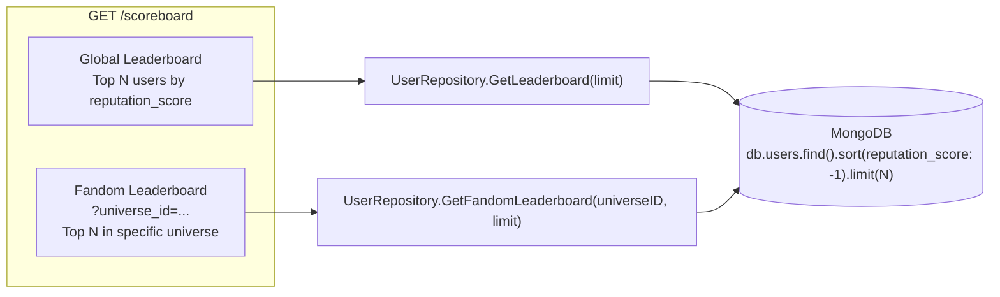
```mermaid
flowchart LR
    subgraph Leaderboard["GET /scoreboard"]
        GlobalLB["Global Leaderboard<br/>Top N users by reputation_score"]
        FandomLB["Fandom Leaderboard<br/>?universe_id=...<br/>Top N in specific universe"]
    end

    GlobalLB --> UserRepo["UserRepository.GetLeaderboard(limit)"]
    FandomLB --> FandomRepo["UserRepository.GetFandomLeaderboard(universeID, limit)"]

    UserRepo --> DB[("MongoDB<br/>db.users.find().sort(reputation_score: -1).limit(N)")]
    FandomRepo --> DB
```

---

## 14. Workflow: News Feed Tag-Voting & Community Moderation (v2 Design)

> **⚠️ Note:** This workflow comes from the product design documents and UI mockups. It represents the **v2 target architecture**. The current backend implements the prediction, sentiment, and context pillars but does not yet fully implement the tag-voting moderation system.

### 14.1 Content Submission & Auto-Tagging

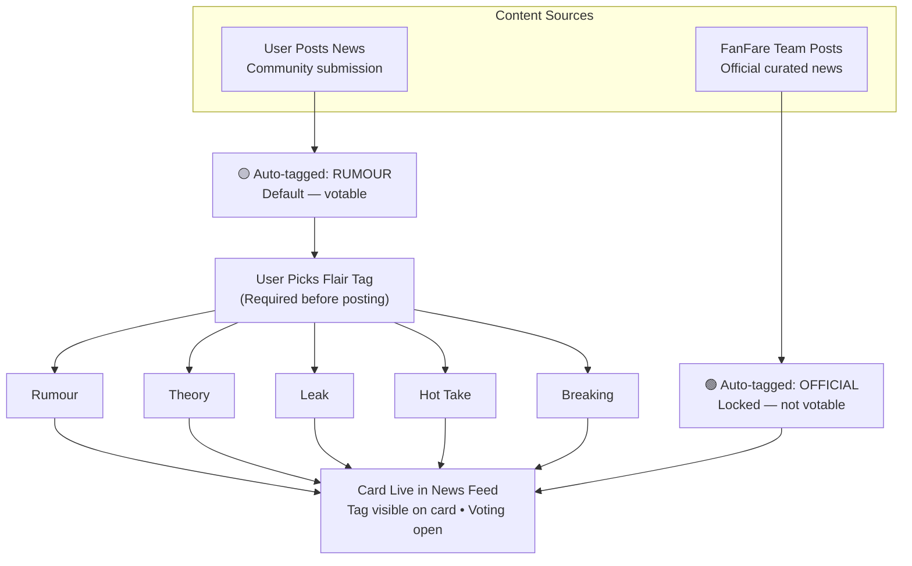
```mermaid
flowchart TD
    subgraph Sources["Content Sources"]
        TeamPost["FanFare Team Posts<br/>Official curated news"]
        UserPost["User Posts News<br/>Community submission"]
    end

    TeamPost --> AutoOfficial["🟢 Auto-tagged: OFFICIAL<br/>Locked — not votable"]
    UserPost --> AutoRumour["🟡 Auto-tagged: RUMOUR<br/>Default — votable"]

    AutoRumour --> FlairPicker["User Picks Flair Tag<br/>(Required before posting)"]
    FlairPicker --> R["Rumour"]
    FlairPicker --> T["Theory"]
    FlairPicker --> L["Leak"]
    FlairPicker --> H["Hot Take"]
    FlairPicker --> B["Breaking"]

    R & T & L & H & B --> LiveCard
    AutoOfficial --> LiveCard["Card Live in News Feed<br/>Tag visible on card • Voting open"]
```

### 14.2 Community Voting & Tag Flipping

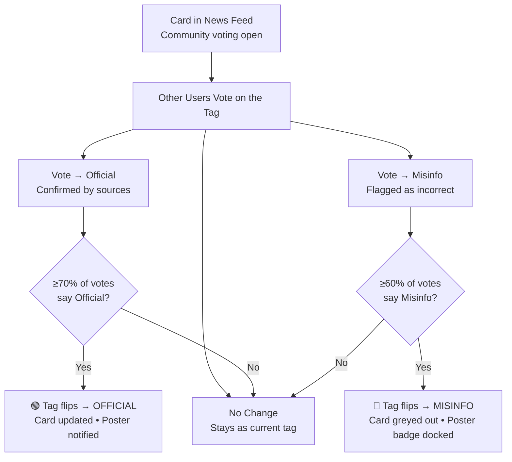
```mermaid
flowchart TD
    LiveCard["Card in News Feed<br/>Community voting open"] --> Votes["Other Users Vote on the Tag"]

    Votes --> VoteOfficial["Vote → Official<br/>Confirmed by sources"]
    Votes --> NoChange["No Change<br/>Stays as current tag"]
    Votes --> VoteMisinfo["Vote → Misinfo<br/>Flagged as incorrect"]

    VoteOfficial --> Threshold70{"≥70% of votes<br/>say Official?"}
    Threshold70 -->|Yes| FlipOfficial["🟢 Tag flips → OFFICIAL<br/>Card updated • Poster notified"]
    Threshold70 -->|No| NoChange

    VoteMisinfo --> Threshold60{"≥60% of votes<br/>say Misinfo?"}
    Threshold60 -->|Yes| FlipMisinfo["🔴 Tag flips → MISINFO<br/>Card greyed out • Poster badge docked"]
    Threshold60 -->|No| NoChange
```

### 14.3 Reward & Penalty Outcomes

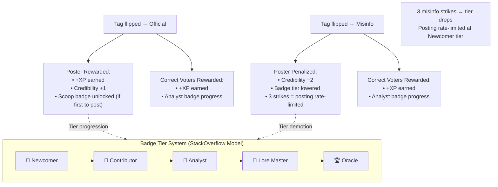
```mermaid
flowchart TD
    FlipOfficial["Tag flipped → Official"] --> PosterReward["Poster Rewarded:<br/>• +XP earned<br/>• Credibility +1<br/>• Scoop badge unlocked (if first to post)"]
    FlipOfficial --> VoterReward1["Correct Voters Rewarded:<br/>• +XP earned<br/>• Analyst badge progress"]

    FlipMisinfo["Tag flipped → Misinfo"] --> PosterPenalty["Poster Penalized:<br/>• Credibility −2<br/>• Badge tier lowered<br/>• 3 strikes = posting rate-limited"]
    FlipMisinfo --> VoterReward2["Correct Voters Rewarded:<br/>• +XP earned<br/>• Analyst badge progress"]

    subgraph Tiers["Badge Tier System (StackOverflow Model)"]
        direction LR
        T1["🥉 Newcomer"] --> T2["🥈 Contributor"] --> T3["🥇 Analyst"] --> T4["👑 Lore Master"] --> T5["🏆 Oracle"]
    end

    PosterReward -.->|Tier progression| Tiers
    PosterPenalty -.->|Tier demotion| Tiers

    Note1["3 misinfo strikes → tier drops<br/>Posting rate-limited at Newcomer tier"]
```

### Voting Thresholds Summary

| Vote Direction | Threshold | Effect |
|----------------|:---------:|--------|
| → Official | ≥ 70% votes | Card upgraded, poster gains +XP and credibility |
| → Misinfo | ≥ 60% votes | Card greyed, poster loses credibility; 3× = rate-limited |
| No change | Below thresholds | Card retains current tag |

---

## 15. Service Dependency Matrix

This table shows which repositories each service and handler depends on:

### Services → Repositories

| Service | UserRepo | ContentRepo | PredictionRepo | ContextRepo |
|---------|:--------:|:-----------:|:--------------:|:-----------:|
| **AuthService** | ✅ | — | — | — |
| **ScoringService** | ✅ | — | ✅ | ✅ |
| **ReputationService** | ✅ | — | ✅ | ✅ |

### Handlers → Services & Repositories

| Handler | AuthService | ScoringService | ReputationService | ContentRepo | PredictionRepo | ContextRepo | UserRepo |
|---------|:-----------:|:--------------:|:-----------------:|:-----------:|:--------------:|:-----------:|:--------:|
| **AuthHandler** | ✅ | — | ✅ | — | — | ✅ | — |
| **ContentHandler** | — | — | — | ✅ | ✅ | — | — |
| **PredictionHandler** | — | ✅ | — | — | ✅ | — | — |
| **SentimentHandler** | — | ✅ | — | — | ✅ | — | — |
| **ContextHandler** | — | — | — | — | — | ✅ | ✅ |

### Initialization Order (main.go)

```
1. LoadConfig()                    → reads .env
2. ConnectMongo()                  → establishes connection, creates indexes
3. Initialize Repositories        → MongoUserRepo, MongoContentRepo, MongoPredictionRepo, MongoContextRepo
4. Initialize Services             → AuthService, ScoringService, ReputationService
5. Seed Database                   → populates sample universes, titles, moments, predictions, polls
6. Initialize Handlers             → AuthHandler, ContentHandler, PredictionHandler, SentimentHandler, ContextHandler
7. Configure Router + Middleware   → RequestLogger → CORS → Recovery → Routes
8. Start Server                    → router.Run(":8080")
```

---

## 16. Configuration & Environment Variables

Configuration is loaded from environment variables with optional `.env` file fallback (via `godotenv`).

| Variable | Default | Description |
|----------|---------|-------------|
| `PORT` | `8080` | HTTP server port |
| `MONGODB_URI` | `mongodb://localhost:27017` | MongoDB connection string (Atlas or local) |
| `MONGODB_DB_NAME` | `fanfare` | Database name |
| `JWT_SECRET` | `supersecretfanfarejwtkey2026!` (insecure fallback) | JWT HMAC signing key |

> **⚠️ Security:** The fallback `JWT_SECRET` is only for development. In production, always set a strong, random secret via environment variable.

---

## 17. Test Coverage

All tests are in `internal/services/` and use **mock repositories** to test business logic in isolation.

| Test Suite | File | Tests | What's Tested |
|-----------|------|:-----:|---------------|
| **Auth Service** | `auth_service_test.go` | 2+ | Registration flow, duplicate username/email checks, bcrypt hashing, JWT signing & validation |
| **Scoring Engine** | `scoring_service_test.go` | 2+ | Confidence multipliers (low/med/high), minority bonus calculation, point allocation, prediction resolution |
| **Reputation** | `reputation_service_test.go` | 2+ | Dynamic badge evaluation (Analyst, Lore Master, Hype Leader), fallback Fan badge, accuracy calculation |

Run all tests:
```bash
go test -v ./internal/services/...
```

Expected output: **5 PASS, 0 FAIL**

---

## 18. Multi-Developer Setup

FanFare is designed for a **2-person team** (Go backend + TypeScript frontend):

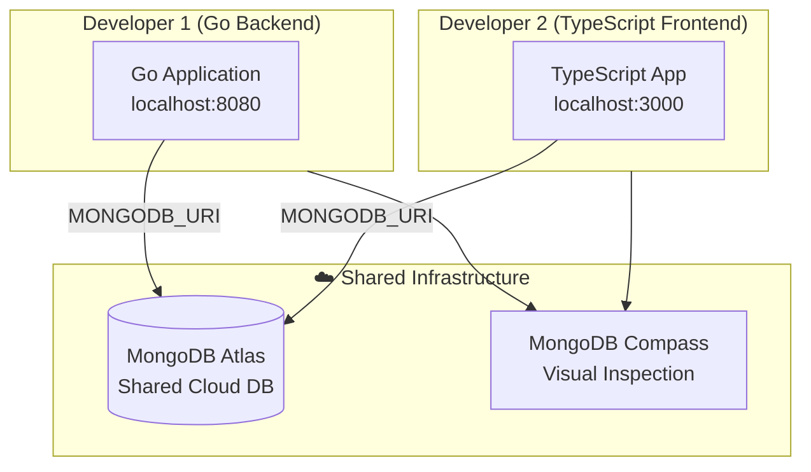
```mermaid
graph TB
    subgraph Dev1["Developer 1 (Go Backend)"]
        GoApp["Go Application<br/>localhost:8080"]
    end

    subgraph Dev2["Developer 2 (TypeScript Frontend)"]
        TSApp["TypeScript App<br/>localhost:3000"]
    end

    subgraph Shared["☁️ Shared Infrastructure"]
        Atlas[("MongoDB Atlas<br/>Shared Cloud DB")]
        Compass["MongoDB Compass<br/>Visual Inspection"]
    end

    GoApp -->|MONGODB_URI| Atlas
    TSApp -->|MONGODB_URI| Atlas
    Dev1 --> Compass
    Dev2 --> Compass
```

**Setup Steps:**
1. Both developers use the **same `.env`** file with a shared `MONGODB_URI` pointing to Atlas
2. **MongoDB Compass** installed on both machines for visual data inspection
3. **Shared collection schemas** and **compound indexes** ensure data consistency regardless of which backend writes

---

## Appendix A: File Structure Reference

```
fanfare-backend/
├── cmd/api/
│   └── main.go                         # Server entrypoint — DI wiring & route registration
├── internal/
│   ├── config/
│   │   └── config.go                   # Environment config loader (.env + fallbacks)
│   ├── db/
│   │   ├── mongo.go                    # MongoDB connection, ping, index creation (12 collections)
│   │   └── seeder.go                   # First-run sample data (universes, titles, moments, polls)
│   ├── models/
│   │   └── models.go                   # 16 BSON/JSON structs + request/response types
│   ├── repository/
│   │   ├── interfaces.go              # 4 Go interfaces (clean architecture contracts)
│   │   ├── errors.go                  # Shared ErrNotFound sentinel error
│   │   └── mongodb/
│   │       ├── user_repo.go           # CRUD for users, follow, leaderboards
│   │       ├── content_repo.go        # CRUD for universes, titles, moments, issue hubs
│   │       ├── prediction_repo.go     # CRUD for predictions, participations, sentiment polls/votes
│   │       └── context_repo.go        # CRUD for context cards, ratings, reputation history
│   ├── services/
│   │   ├── auth_service.go            # Bcrypt + JWT authentication
│   │   ├── auth_service_test.go       # Auth unit tests (mock repos)
│   │   ├── scoring_service.go         # Prediction resolution + point engine + poll vote points
│   │   ├── scoring_service_test.go    # Scoring unit tests
│   │   ├── reputation_service.go      # Profile stats compilation + dynamic badge evaluation
│   │   └── reputation_service_test.go # Badge evaluation unit tests
│   ├── handlers/
│   │   ├── auth_handler.go            # Register, Login, GetMe, Profile, Follow, Scoreboard, RepHistory
│   │   ├── content_handler.go         # Universes, Titles, Moments (paginated), IssueHubs, linked predictions
│   │   ├── prediction_handler.go      # Vote on prediction, Resolve prediction
│   │   ├── sentiment_handler.go       # Vote in sentiment poll, Dashboard with cohort aggregation
│   │   └── context_handler.go         # Create context card (+5pts), Rate card (helpful→+2pts)
│   └── middleware/
│       ├── auth_middleware.go          # JWT Bearer extraction & validation
│       ├── cors.go                    # Cross-origin support
│       └── logging.go                 # Request method/path/status/latency logging
├── docs/
│   ├── swagger.yaml                   # OpenAPI 3.0 specification
│   └── ARCHITECTURE.md               # This file
├── .env                               # Local environment config
├── go.mod                             # Go module definition
├── go.sum                             # Dependency checksums
└── README.md                          # Project README
```

---

## Appendix B: Glossary

| Term | Definition |
|------|-----------|
| **Universe** | A pop-culture franchise (MCU, DC, K-Pop, Anime) |
| **Title** | A watchable unit within a universe (film, show, album) |
| **Moment** | A news card — the atom of the feed (e.g. "Deadpool crosses $1B") |
| **Issue Hub** | A long-running community debate with timeline and evidence |
| **Prediction** | A structured question with options that users can vote on |
| **Participation** | A user's vote on a prediction, including confidence level |
| **Sentiment Poll** | A quick opinion poll (hype, support, satisfaction) |
| **Context Card** | A crowdsourced fact-check note with three sections: accurate, missing, speculative |
| **Reputation Score** | Cumulative points earned through predictions, context, and polls |
| **Badge** | A dynamic credential evaluated in real-time based on activity thresholds |
| **Minority Bonus** | Extra points for correct predictions when most people guessed wrong |
| **Flair Tag** | A label users assign to their posts (Rumour, Theory, Leak, Hot Take, Breaking) |

---

_This document was auto-generated from codebase analysis. For the full API specification, see `docs/swagger.yaml`._
